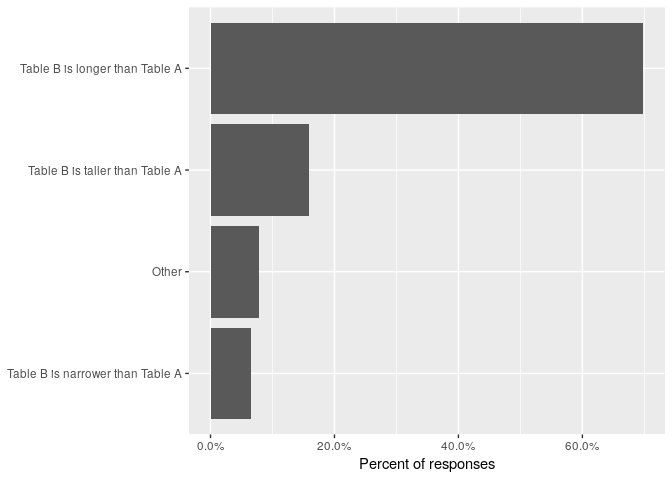

Pivot function names
====================

On 2019-03-22, I [tweeted about](https://twitter.com/hadleywickham/status/1109132826631421952) a [survey](https://forms.gle/vvYgBw1EwHK69gA17) to help me pick names for the [new pivot functions](https://tidyr.tidyverse.org/dev/articles/pivot.html) in the dev version of tidyr.

In the survey, I showed a picture of two tables containing the same data, and asked participants to describe their relative shapes. This document describes the results.


``` r
library(googlesheets)
library(tidyverse)

# This googlesheet is public if you want to do your own analysis
key <- gs_key("1Do5R1k5sEZrwU0N1KmIjKaapHDrf7eYLdIlcGNx-MsI")
results <- googlesheets::gs_read(key, col_types = list())
names(results) <- c("timestamp", "table_a", "table_b")
head(results)
#> # A tibble: 6 x 3
#>   timestamp         table_a                     table_b                    
#>   <chr>             <chr>                       <chr>                      
#> 1 3/22/2019 10:30:… Table A is tidier than Tab… Table B is deeper than Tab…
#> 2 3/22/2019 10:31:… Table A is wider than Tabl… Table B is taller than Tab…
#> 3 3/22/2019 10:32:… Table A is wider than Tabl… Table B is taller than Tab…
#> 4 3/22/2019 10:33:… Table A is wider than Tabl… Table B is longer than Tab…
#> 5 3/22/2019 10:34:… Table A is wider than Tabl… Table B is longer than Tab…
#> 6 3/22/2019 10:37:… Table A is shallower than … Table B is narrower than T…

nrow(results)
#> [1] 2652

# Capture for posterity
write_csv(results, "results.csv")
```

Table A -&gt; Table B
---------------------

Wider is the clear winner with ~80% of responses.

``` r
table_a <- results %>% 
  filter(!is.na(table_a)) %>% 
  mutate(top3 = table_a %>% fct_lump(3) %>% fct_infreq() %>% fct_rev()) %>%
  count(top3) %>% 
  mutate(prop = n / sum(n))

table_a %>% 
  ggplot(aes(top3, prop)) +
  geom_col() +
  scale_y_continuous(labels = scales::percent) +
  labs(
    x = NULL,
    y = "Percent of responses"
  ) + 
  coord_flip()
```


There were a wide range of write in respones. The most popular included concise, compact, condense, denser.

``` r
results %>% 
  mutate(
    table_a = table_a %>% 
      str_remove("Table A is ") %>% 
      str_remove(" than Table B") %>% 
      str_trunc(50)
  ) %>% 
  count(table_a, sort = TRUE) %>% 
  print(n = Inf)
#> # A tibble: 99 x 2
#>    table_a                                                n
#>    <chr>                                              <int>
#>  1 wider                                               2123
#>  2 shorter                                              329
#>  3 shallower                                             90
#>  4 Compact                                                4
#>  5 more compact                                           4
#>  6 Denser                                                 3
#>  7 <NA>                                                   2
#>  8 Condensed                                              2
#>  9 fatter than table B                                    2
#> 10 Horizontal                                             2
#> 11 smaller                                                2
#> 12 wider and shorter                                      2
#> 13 %>% select(x, y, z) %>%                                1
#> 14 3D                                                     1
#> 15 "a \"condensed\" version of Table B"                   1
#> 16 a gathered Table B                                     1
#> 17 A is a condense of B                                   1
#> 18 A is more collective than B                            1
#> 19 A is the pivot shape of B                              1
#> 20 A is the unpivot of B                                  1
#> 21 buxom                                                  1
#> 22 By individual / by observation                         1
#> 23 cases by variable, i.e. wider                          1
#> 24 cleaner                                                1
#> 25 coiled up compared to table B                          1
#> 26 colum heavy                                            1
#> 27 column-heavy as compared to Table B                    1
#> 28 Compact. Far fewer data cells required in table A.     1
#> 29 concise version table B                                1
#> 30 Concise, Row Complete, completeR, conciseR             1
#> 31 condensed than table B                                 1
#> 32 Denormslised                                           1
#> 33 Dense                                                  1
#> 34 denser than table B.                                   1
#> 35 distinct, indexed on ID, fact table                    1
#> 36 expanded by columns                                    1
#> 37 Fater                                                  1
#> 38 fatter                                                 1
#> 39 Flatter                                                1
#> 40 For this specific example, I would say shorter....     1
#> 41 Funkier                                                1
#> 42 horizontal vs Table B is vertical                      1
#> 43 horizontal, or column-wise                             1
#> 44 implicit                                               1
#> 45 In A each observation repeats only once                1
#> 46 Keep it as gather/spread.                              1
#> 47 Less melted                                            1
#> 48 more aggregated                                        1
#> 49 More compact                                           1
#> 50 more compact / succinct / concise                      1
#> 51 more compact and easy to read                          1
#> 52 more compact than table B                              1
#> 53 More compact.                                          1
#> 54 more compressed.                                       1
#> 55 more concentrated than table B                         1
#> 56 more concise                                           1
#> 57 more condensed                                         1
#> 58 More dense (more info per cell)                        1
#> 59 more spread                                            1
#> 60 notidy                                                 1
#> 61 pedantic                                               1
#> 62 pivot                                                  1
#> 63 Pivoted                                                1
#> 64 pivoted on “n” as its columns                          1
#> 65 Reshape                                                1
#> 66 row_condensed                                          1
#> 67 Russia                                                 1
#> 68 Short fat                                              1
#> 69 short-form of Table B.                                 1
#> 70 short-wide                                             1
#> 71 Shorter and fatter                                     1
#> 72 shorter and fatter (wider)                             1
#> 73 shorter and wider                                      1
#> 74 shorter and wider but not shallower                    1
#> 75 shorter and wider than B                               1
#> 76 skimpy                                                 1
#> 77 spreaded on b                                          1
#> 78 squash                                                 1
#> 79 Squatter                                               1
#> 80 stacked by id compared to Table B                      1
#> 81 Stout                                                  1
#> 82 "Table \"A\" covers less area than Table \"B\""        1
#> 83 Table 1 is better organized for the human inter...     1
#> 84 Table A has grouped/summarized information from...     1
#> 85 Table A has more columns but less rows                 1
#> 86 table A is of 2 dimensions, while B is of 1 in ...     1
#> 87 Table A looks like a waffle                            1
#> 88 Table A spreads more horizontally than table B         1
#> 89 Table B is CR(Column to Row) transformation of ...     1
#> 90 Table B is taller than Table A                         1
#> 91 Table is wide table b is long                          1
#> 92 Tabular                                                1
#> 93 Te same table, but different presentation or da...     1
#> 94 the before picture of Table B.                         1
#> 95 the unstacked form of Table B                          1
#> 96 They are similar, containing the same information      1
#> 97 thicc while Table B is a sticc                         1
#> 98 tidier                                                 1
#> 99 unique on one variable and is wider                    1
```

Table B -&gt; Table A
---------------------

Longer is the clear winner with ~70% of responses. Given the number of people who suggested taller to me, I had expected it to come in much higher. Interestingly narrower is much less common than shorter, it's equivalent above.

``` r
table_b <- results %>% 
  filter(!is.na(table_b)) %>% 
  mutate(top3 = table_b %>% fct_lump(3) %>% fct_infreq() %>% fct_rev()) %>%
  count(top3) %>% 
  mutate(prop = n / sum(n))

table_b %>% 
  ggplot(aes(top3, prop)) +
  geom_col() +
  scale_y_continuous(labels = scales::percent) +
  labs(
    x = NULL,
    y = "Percent of responses"
  ) + 
  coord_flip()
```



There were a wide range of write in respones. The most popular included expanded and skinnier.

``` r
results %>% 
  mutate(
    table_b = table_b %>% 
      str_remove("Table B is ") %>% 
      str_remove(" than Table A") %>% 
      str_trunc(50)
  ) %>% 
  count(table_b, sort = TRUE) %>% 
  print(n = Inf)
#> # A tibble: 96 x 2
#>    table_b                                                      n
#>    <chr>                                                    <int>
#>  1 longer                                                    1846
#>  2 taller                                                     420
#>  3 narrower                                                   171
#>  4 deeper                                                     116
#>  5 <NA>                                                         7
#>  6 Vertical                                                     2
#>  7 %>% filter(n=='x'|n=='y'|n=='z') %>%                         1
#>  8 2d                                                           1
#>  9 a detailed version of table A                                1
#> 10 a panel, Table A is not                                      1
#> 11 a spread Table A                                             1
#> 12 "an \"expanded\" version of Table A"                         1
#> 13 Atomic                                                       1
#> 14 B is a sublimate of A                                        1
#> 15 B is more individual than A                                  1
#> 16 B is the itemized shape of A                                 1
#> 17 B is the pivot of A                                          1
#> 18 bigger                                                       1
#> 19 By attribute / by key-value                                  1
#> 20 Chile                                                        1
#> 21 clearer than table B.                                        1
#> 22 combonation of variable is unique and is longer              1
#> 23 Down                                                         1
#> 24 Expanded                                                     1
#> 25 expanded by rows                                             1
#> 26 Expanded.                                                    1
#> 27 expansive than table A                                       1
#> 28 explicit                                                     1
#> 29 Extended                                                     1
#> 30 flatter than table A (i.e The value column is t...           1
#> 31 gaunt                                                        1
#> 32 Groovier                                                     1
#> 33 "I think if I hadn't heard of \"wide\" and \"long\",..."     1
#> 34 Keep it as gather/spread.                                    1
#> 35 less compact                                                 1
#> 36 Less dense                                                   1
#> 37 long and narrow                                              1
#> 38 longer and narrower                                          1
#> 39 Looser                                                       1
#> 40 melter                                                       1
#> 41 more diluted than table A                                    1
#> 42 more fragmented or elemental                                 1
#> 43 more likely to be drafted in the NBA. Jk, it's ...           1
#> 44 More melted                                                  1
#> 45 more repetitive / verbose / redundant                        1
#> 46 More slender                                                 1
#> 47 more stretched out.                                          1
#> 48 more verbose                                                 1
#> 49 more vertically stacked than table A                         1
#> 50 narrow-long                                                  1
#> 51 narrower and longer                                          1
#> 52 Needs more rows for each observation                         1
#> 53 Normalised                                                   1
#> 54 Not deeper                                                   1
#> 55 outrolled                                                    1
#> 56 pivot                                                        1
#> 57 pivoted with “n” in its rows                                 1
#> 58 portrait vs. Table A is landscape                            1
#> 59 redundundant                                                 1
#> 60 repeated observation/measurement of cases by va...           1
#> 61 row heavy                                                    1
#> 62 row_expanded                                                 1
#> 63 row-heavy as compared to Table A                             1
#> 64 skinnier.                                                    1
#> 65 Skinnier/skinny                                              1
#> 66 Skinny                                                       1
#> 67 Slack                                                        1
#> 68 Sparser                                                      1
#> 69 Sparser than table A                                         1
#> 70 stack                                                        1
#> 71 Stacked                                                      1
#> 72 stretched by n compared to Table A                           1
#> 73 stretched out compared to Table A                            1
#> 74 "Table \"B\" has creates options than Table \"A\""           1
#> 75 Table A is RC transformation of Table B                      1
#> 76 Table B has more rows but less columns                       1
#> 77 Take B is skinnier                                           1
#> 78 Tall skinny                                                  1
#> 79 taller and thinner                                           1
#> 80 Taller and thinner                                           1
#> 81 the after photo of Table A                                   1
#> 82 the long-form of Table A.                                    1
#> 83 the stacked form of Table A                                  1
#> 84 Thinner                                                      1
#> 85 thinner and longer                                           1
#> 86 Tidier                                                       1
#> 87 tidy                                                         1
#> 88 transaction table, not indexed on ID                         1
#> 89 transposed of table A                                        1
#> 90 Unbind variables for each id                                 1
#> 91 Unpivoted                                                    1
#> 92 Vectorial                                                    1
#> 93 verbose                                                      1
#> 94 vertical                                                     1
#> 95 wider                                                        1
#> 96 worse                                                        1
```

Conclusion
----------

The new functions will be called `pivot_wider()` and `pivot_longer()`: these are not the most natural names for everyone, but they are are the most popular by a large margin. I like pivot because it suggests the form of the underlying operation (a pivoting or rotation), and it is evocative to excel users.

A few alternatives that were suggested, considered, and rejected:

-   `VERB_long()`/`VERB_wide()`: not obvious whether they take long/wide data or return long/wide data.

-   `VERB_to_long()`/`VERB_to_wider()`: implies that long and wide are absolute terms. I don't think it makes sense to talk about long or wide form data; you can only say one form is longer or wider than another form.

-   `to_long()`/`to_wide()`: isn't a verb, and implies that there's only one operation that makes data longer/wider. The next version of tidyr will also contain functions that unnest list-columns of vectors, and that verb (name TBA) also needs directional suffixes.

-   `reshape_SHAPE`: too much potential for confusion with the existing `stats::reshape()`

-   `gather()`/`spread()`: while some people clearly liked these functions they were not memorable to a large number of people I talked to.

I appreciate the enthusiasm that people have for naming functions!
